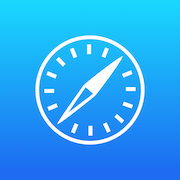
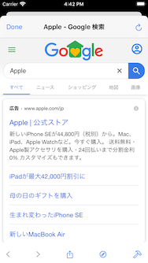
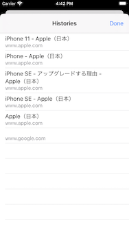
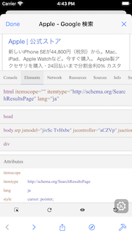

# AppPattern: In-App Browser (SwiftUI)

This is an implementation example of an application feature called "In-App Browser".
The In-App Browser is used when you want to display a web site in the app without moving to the Safari.

- [Features](#Features)
- [Requirements](#requirements)
- [Author](#author)
- [License](#license)

## Features
- [x] Using SwiftUI.
- [x] Progress bar.
- [x] Javascript popups.
- [x] iTunes URL.
- [x] Basic auth.
- [x] Peek and pop link.
- [x] BackForward list.
- [x] Developer tools.

## Requirements

* iOS 13.0+
* Xcode 11.0+
* Swift 5.0+

## Screenshots

## Author

Watanabe Toshinori – toshinori_watanabe@tiny.blue

## License

This project is licensed under the MIT License. See the [LICENSE](LICENSE) file for details.
